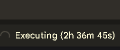
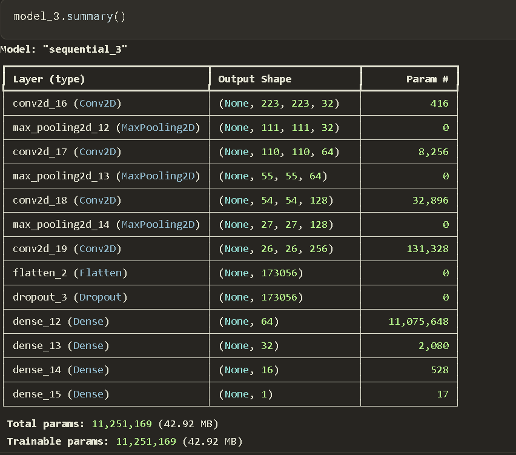
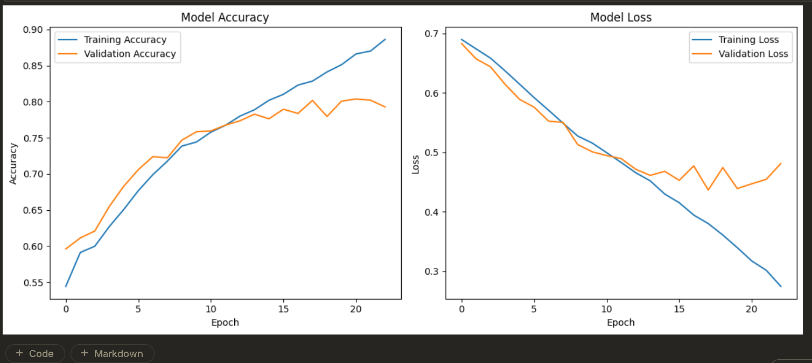
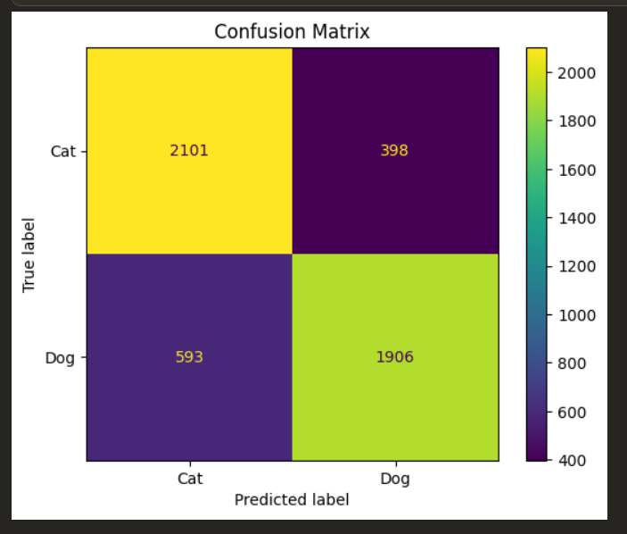

# DeepLearningModels

This Repository Contains Deep Learning models from scratch to the level needed. The code contains all the necessary comments and readme files contains all the notes.

# PROJECT OF DEEP LEARNING WITH CNN:

## Dog And Cat Classifier:

### Day 1 — Dataset Collection & Project Setup (05-09-2026) **(Happy Teachers Day)**

- Collected and Uploaded 809.54MB dataset including 25000 images of cats and dogs.

- **Folder Structure:**
  - Today, I started my **Dog vs Cat Image Classification** project using **TensorFlow/Keras**.
  - Collected a total of **25,000 images**, equally distributed between the two classes:
    - 🐶 **Dogs:** 12,500 images
    - 🐱 **Cats:** 12,500 images

  Since both classes contain an equal number of images, there is **no class-count imbalance** in the dataset.

## Dataset Folder Structure

The dataset is organized into two class folders:

    dataset/
    ├── dogs/
    │   ├── dog_001.jpg
    │   ├── dog_002.jpg
    │   ├── ...
    │   └── dog_12500.jpg
    │
    └── cats/
        ├── cat_001.jpg
        ├── cat_002.jpg
        ├── ...
        └── cat_12500.jpg

---

### Day 2 — Cleaned the Data and Training a Custom CNN Model (10-09-2026)

**Experimental Training of a Custom CNN**

- Input - input of `(224,224,3)`
- Total params: `5,631,169 (21.48 MB)`
- Trainable params: `5,631,169 (21.48 MB)`
- Non-trainable params: `0 (0.00 B)`
- Total No of Epochs: `5`
- Trained a baseline model and with 20% of validation data and 80% training subset.

## Observation

The main goal of this experiment was not just to obtain accuracy, but to understand how a neural network learns and how the different components of the training process work.

## What I Learned

### 1. Training Data vs Validation Data

I learned how the dataset is divided into training and validation data.

- **Training data** is used to calculate the loss and update the model's learnable parameters during training.
- **Validation data** is not used to update the parameters. It is used to evaluate how well the trained model performs on unseen data after each epoch.

This helped me understand why both training accuracy/loss and validation accuracy/loss are important.

### 2. Parameters of a Neural Network

I learned that the actual parameters of a neural network are its **learnable weights and biases**.

During training:

1. The model performs a forward pass.
2. The loss function calculates the error.
3. Backpropagation calculates gradients.
4. The optimizer updates the weights and biases.

I also learned the difference between:

- **Parameters:** weights and biases learned during training.
- **Hyperparameters:** values chosen before/during training, such as learning rate, batch size, number of epochs, number of filters, kernel size, and number of neurons.

### 3. Understanding CNN Architecture

I explored how the major CNN components work:

- Convolutional layers
- Filters/kernels
- Feature maps
- Max Pooling
- Flattening
- Dense layers
- Sigmoid activation for binary classification

I also learned how the dimensions of the data change after each layer and how the number of parameters is calculated.

### 4. Overfitting vs Underfitting

The experimental training helped me understand the difference between overfitting and underfitting.

In my experiment, training accuracy increased to approximately **90.76%**, while validation accuracy reached approximately **81.25%**.

The increasing gap between training and validation performance, along with the increase in validation loss during the final epoch, indicated that the model was beginning to **overfit** the training data.

This gave me a practical understanding of overfitting rather than learning it only theoretically.

**Overfitting:** When model performs very well in training process but not so good during testing process is termed as Overfitting where the model is just mugging up not actually learning the weights and biases of model properly.

## 5. Experimental Result


This model will be used as a **baseline** for comparison with the next model.

## Key Takeaway

The most important outcome of today's experiment was understanding the complete training process of a CNN — from input images, convolution and feature extraction, to parameter updates, validation, and identifying overfitting.

The next step will be to train an improved model and compare its performance against this baseline.

---

## Day 3 — Another Custom CNN with Regularization to Prevent Overfitting (14-09-2026)

### 1. What I Learned

1. **Max-Pooling:** It is a downsampling operation used to reduce the spatial dimensions of a feature map by taking the maximum value from each `n × m` patch.

2. **Regularization:** It is a set of techniques used to reduce overfitting and improve the model's ability to generalize to unseen data.

   - **Dropout:** A regularization technique in which some neurons are randomly deactivated during the training process. This prevents the model from becoming too dependent on particular neurons and can help reduce overfitting.

   - **L1 Regularization:** Adds a penalty based on the absolute values of the model's weights to the loss function. It can encourage some weights to become zero.

   - **L2 Regularization:** Adds a penalty based on the squared values of the model's weights to the loss function. It encourages the model to keep weights smaller and can help reduce overfitting.

3. **Experiment with Dropout:** I added Dropout layers with different dropout rates to the CNN to investigate whether regularization could reduce the overfitting observed in the baseline CNN.

4. **Experimental Result:** The model did not learn effectively and remained around `50%` training and validation accuracy after 10 epochs. This indicated that the model was approximately performing random classification on the balanced dataset.

5. **Important Learning:** Adding a technique that is intended to improve a model does not automatically make the model better. Regularization needs to be applied appropriately. This experiment helped me understand that some experiments are performed not only to achieve better accuracy, but also to understand how different techniques affect model learning.

### Model 2 Architecture

`Input → Conv2D → MaxPooling → Dropout → Conv2D → MaxPooling → Dropout → Conv2D → MaxPooling → Dropout → Flatten → Dense → Dropout → Output`

### Model Parameters And Summary


- Total Parameters: `5,631,169`
- Trainable Parameters: `5,631,169`
- Non-trainable Parameters: `0`

### Model 2 Result

- Training Accuracy: approximately `50%`
- Validation Accuracy: `50%`
- The model failed to learn meaningful patterns during the experiment.

### Comparison with Day 2 Baseline

- Baseline model was performing good but there was the problem of overfitting for which I used dropout technique which magnificently affected the model
- and output was more worse than before. it was around 50% for accuracy and 50% validation accuracy.

### Key Takeaway

> Not every experiment is performed to achieve the best result. Some experiments are performed to understand what works, what does not work, and why.

## Day 4 — Model Training, Evaluation & Resource Optimization
**(17-09-2026)**

### 🚀 Overview

Day 4 focused on training and evaluating **Model 3** of the Dog and Cat Classifier.

During the training process, I encountered a major computational limitation while using Google Colab. The initial training setup required several hours for a single epoch, making multi-epoch training impractical.

Instead of stopping the experiment, I explored an alternative training environment and moved the training workflow to **Kaggle Notebook**, where I was able to access a **T4 × 2 GPU configuration**.

I also experimented with the model architecture and training configuration to improve the learning behavior of the CNN.

---

# 1. 🖥️ Computational Resource Limitation

The dataset contains approximately:

- **25,000 images**
- Approximately **809 MB**
- Binary classification: **Dog vs Cat**
- Input image size: **224 × 224 × 3**

During the initial training process on Google Colab, the model required approximately **3–4 hours per epoch**.

This made training for multiple epochs impractical within the available runtime.

### Problem
- Google collab was taking so much time for just one epoch due to initial overhead so i turned to kaggle notebook and transferred  all things there.
 

```text
Large Dataset
     ↓
Custom CNN
     ↓
Large Number of Parameters
     ↓
Very Long Training Time
     ↓
Limited Runtime
```

# Solution:

```text
Google Colab
     ↓
Resource limitation
     ↓
Dataset packaged into ZIP
     ↓
Google Drive
     ↓
Kaggle Notebook
     ↓
T4 × 2 GPU
     ↓
Training
```

## Model _ 3 architecture:
```text
Input
224 × 224 × 3
      ↓
Conv2D — 32 filters
      ↓
MaxPooling2D
      ↓
Conv2D — 64 filters
      ↓
MaxPooling2D
      ↓
Conv2D — 128 filters
      ↓
MaxPooling2D
      ↓
Conv2D — 256 filters
      ↓
Flatten
      ↓
Dropout
      ↓
Dense — 64
      ↓
Dense — 32
      ↓
Dense — 16
      ↓
Dense — 1
      ↓
Sigmoid
      ↓
Dog / Cat
```
## Model Summary:



### Video:

<video src="Screensort/Screen Recording 2026-09-17 134254.mp4" controls width="700">This shows the no of epochs</video>

## Model Result and Graphs:





## What I used :

 -> Early Stopping and Model checkpoints callback to efficiently use the compute resource and get me the best output.  
 -> SGD optimizer with learning rate of 0.01.  
 -> LeakyReLu  Activation function to prevent dying ReLu problem.  

## What next:

  - I will move with pretrained models so as to get better accuracy and prevent overfitting.

## Learning :

  - Increasing Epochs or Changing some values does not make any big changes taking every step after thinking is important.


# Day 5 - Transfer Learning, Model Comparison & Final Evaluation  [22-09-26]

Today, I started learning and working with **pretrained models** to improve the accuracy and efficiency of my Dog & Cat Classification project.

I worked with two lightweight and efficient pretrained architectures:

* **EfficientNetB0**
* **MobileNet**

## Model Comparison

### EfficientNetB0

I first experimented with **EfficientNetB0**. Although the data pipeline was working correctly and the model architecture was properly configured, the model was not learning as expected.

The accuracy showed very limited improvement and was not increasing significantly during training. This helped me understand that even when the data pipeline and architecture appear to be correct, a model may still not perform well due to factors such as training configuration, preprocessing, or other model-specific considerations.

### MobileNet

I then experimented with **MobileNet**, which showed a significant improvement compared to EfficientNetB0.

The model achieved approximately **98% accuracy**, along with strong:

* Precision
* Recall
* F1-Score

This made MobileNet the final pretrained model I decided to use for this project.

## Creating a Separate Test Dataset

For the final evaluation, I created a **new test dataset** by downloading images from the internet.

I manually worked on the dataset by


* Collecting images from different sources
* Cleaning the dataset
* Removing unsuitable or irrelevant images
* Organizing the images into the required class folders
* Using the dataset to evaluate the model on previously unseen images
* I collected total of 246 Images of Cat and 243 Dog images for testing purpose.
  
The purpose of creating a separate test dataset was to evaluate how the trained model performs on images that were not part of the training or validation process.

## What I Learned From This Project

This project taught me much more than simply building a CNN model.

Throughout the project, I learned and practically worked with several important concepts in **Deep Learning and Model Evaluation**, including:

### 1. Overfitting and Underfitting
-> Overfitting -When model performs very well in training process but not so good during testing process is termed as Overfitting where the model is just mugging up not actually learning the weights and biases of model properly.

-> Underfitting - When the model performs not so well on training data as well as on unseen test data is called underfitting.

I learned how a model can perform very well on training data but fail to generalize to unseen data, and how insufficient learning can result in underfitting.

### 2. Dataset Splitting

I learned why datasets are divided into:
* Training data
* Validation data
* Test data

and how each of them serves a different purpose during model development and evaluation.

### 3. Evaluation Metrics

One of the most important things I learned is that **accuracy alone is not enough** to evaluate a classification model.

I learned about:

* Accuracy - How accurately does the model predicts the cases of both classes. It's the most basic metrics and we must not rely only on accuracy in classification problems.
* Precision - It tells out of all positive predicted cases how many cases are actually correct.
* Recall - It is also called True Positive Rate and it tell's out of all positive cases exist how many model actually predicted positive.
* F1-Score - It is harmonic mean of precision and recall.
* True Positives (TP) - The actual and predicted values are of positive classes.
* True Negatives (TN) - The actual and predicted values are of negative classes.
* False Positives (FP) - The negative classes which has been falsely predicted as positive by model.
* False Negatives (FN) - These are positive case which has been falsely predicted as negative by model.

I also learned why different evaluation metrics are important depending on the problem we are solving.

### 4. Confusion Matrix

I learned what a **Confusion Matrix** represents and how it helps us understand the actual predictions made by a classification model.

I also learned how values such as TP, TN, FP, and FN are obtained from model predictions and how these values are used to calculate precision, recall, and F1-score.

### 5. Handling Resource Limitations

While working with a large image dataset, I faced practical limitations related to:

* RAM
* Storage
* GPU computation
* Training time

This taught me how to work around resource limitations and make better use of available computing resources.

### 6. Working With Pretrained Models

I learned how pretrained models such as **EfficientNetB0 and MobileNet** can be used for computer vision tasks and how different architectures can behave differently even when working with the same dataset.

## Final Reflection

This is the final model I am training for this project, and I have learned a lot throughout the entire process.

What started as a simple **Dog & Cat Classification project** turned into a practical learning experience covering:

**CNN → Training → Validation → Overfitting & Underfitting → Dataset Splitting → Transfer Learning → Resource Management → Confusion Matrix → Classification Report → Precision → Recall → F1-Score → Model Evaluation**

The biggest takeaway for me is that **building a machine learning model is not only about achieving high accuracy**. Understanding how the model performs, where it makes mistakes, and which evaluation metrics properly describe its performance is equally important.

I am looking forward to learning more and improving my skills by working on more **Deep Learning and Computer Vision projects**. 🚀
