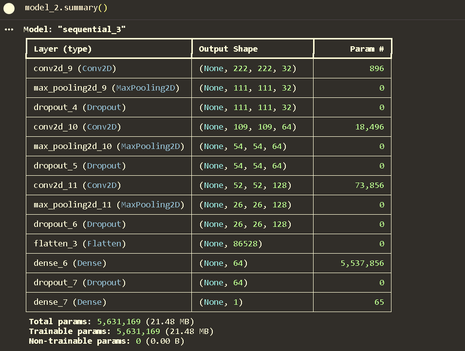
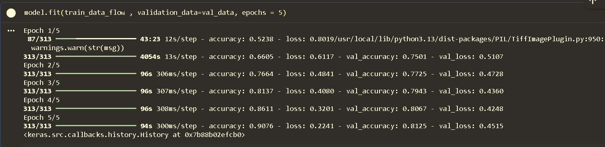

# DeepLearningModels

This Repository Contains Deep Learning models from scratch to the level needed. The code contains all the necessary comments and readme files contains all the notes.

# PROJECT OF DEEP LEARNING WITH CNN:

## Dog And Cat Classifier:

### Day 1 — Dataset Collection & Project Setup (05-09-2026) **(Happy Teachers Day)**

- Collected and Uploaded 809.54MB dataset including 25000 images of cats and dogs.

- **Folder Structure:**
  - Today, I started my **Dog vs Cat Image Classification** project using **TensorFlow/Keras**.
  - Collected a total of **25,000 images**, equally distributed between the two classes:
    - 🐶 **Dogs:** 12,500 images
    - 🐱 **Cats:** 12,500 images

  Since both classes contain an equal number of images, there is **no class-count imbalance** in the dataset.

## Dataset Folder Structure

The dataset is organized into two class folders:

    dataset/
    ├── dogs/
    │   ├── dog_001.jpg
    │   ├── dog_002.jpg
    │   ├── ...
    │   └── dog_12500.jpg
    │
    └── cats/
        ├── cat_001.jpg
        ├── cat_002.jpg
        ├── ...
        └── cat_12500.jpg

---

### Day 2 — Cleaned the Data and Training a Custom CNN Model (10-09-2026)

**Experimental Training of a Custom CNN**

- Input - input of `(224,224,3)`
- Total params: `5,631,169 (21.48 MB)`
- Trainable params: `5,631,169 (21.48 MB)`
- Non-trainable params: `0 (0.00 B)`
- Total No of Epochs: `5`
- Trained a baseline model and with 20% of validation data and 80% training subset.

## Observation

The main goal of this experiment was not just to obtain accuracy, but to understand how a neural network learns and how the different components of the training process work.

## What I Learned

### 1. Training Data vs Validation Data

I learned how the dataset is divided into training and validation data.

- **Training data** is used to calculate the loss and update the model's learnable parameters during training.
- **Validation data** is not used to update the parameters. It is used to evaluate how well the trained model performs on unseen data after each epoch.

This helped me understand why both training accuracy/loss and validation accuracy/loss are important.

### 2. Parameters of a Neural Network

I learned that the actual parameters of a neural network are its **learnable weights and biases**.

During training:

1. The model performs a forward pass.
2. The loss function calculates the error.
3. Backpropagation calculates gradients.
4. The optimizer updates the weights and biases.

I also learned the difference between:

- **Parameters:** weights and biases learned during training.
- **Hyperparameters:** values chosen before/during training, such as learning rate, batch size, number of epochs, number of filters, kernel size, and number of neurons.

### 3. Understanding CNN Architecture

I explored how the major CNN components work:

- Convolutional layers
- Filters/kernels
- Feature maps
- Max Pooling
- Flattening
- Dense layers
- Sigmoid activation for binary classification

I also learned how the dimensions of the data change after each layer and how the number of parameters is calculated.

### 4. Overfitting vs Underfitting

The experimental training helped me understand the difference between overfitting and underfitting.

In my experiment, training accuracy increased to approximately **90.76%**, while validation accuracy reached approximately **81.25%**.

The increasing gap between training and validation performance, along with the increase in validation loss during the final epoch, indicated that the model was beginning to **overfit** the training data.

This gave me a practical understanding of overfitting rather than learning it only theoretically.

**Overfitting:** When model performs very well in training process but not so good during testing process is termed as Overfitting where the model is just mugging up not actually learning the weights and biases of model properly.

## 5. Experimental Result

This model will be used as a **baseline** for comparison with the next model.

## Key Takeaway

The most important outcome of today's experiment was understanding the complete training process of a CNN — from input images, convolution and feature extraction, to parameter updates, validation, and identifying overfitting.

The next step will be to train an improved model and compare its performance against this baseline.

---

## Day 3 — Another Custom CNN with Regularization to Prevent Overfitting (14-09-2026)

### 1. What I Learned

1. **Max-Pooling:** It is a downsampling operation used to reduce the spatial dimensions of a feature map by taking the maximum value from each `n × m` patch.

2. **Regularization:** It is a set of techniques used to reduce overfitting and improve the model's ability to generalize to unseen data.

   - **Dropout:** A regularization technique in which some neurons are randomly deactivated during the training process. This prevents the model from becoming too dependent on particular neurons and can help reduce overfitting.

   - **L1 Regularization:** Adds a penalty based on the absolute values of the model's weights to the loss function. It can encourage some weights to become zero.

   - **L2 Regularization:** Adds a penalty based on the squared values of the model's weights to the loss function. It encourages the model to keep weights smaller and can help reduce overfitting.

3. **Experiment with Dropout:** I added Dropout layers with different dropout rates to the CNN to investigate whether regularization could reduce the overfitting observed in the baseline CNN.

4. **Experimental Result:** The model did not learn effectively and remained around `50%` training and validation accuracy after 10 epochs. This indicated that the model was approximately performing random classification on the balanced dataset.

5. **Important Learning:** Adding a technique that is intended to improve a model does not automatically make the model better. Regularization needs to be applied appropriately. This experiment helped me understand that some experiments are performed not only to achieve better accuracy, but also to understand how different techniques affect model learning.

### Model 2 Architecture

`Input → Conv2D → MaxPooling → Dropout → Conv2D → MaxPooling → Dropout → Conv2D → MaxPooling → Dropout → Flatten → Dense → Dropout → Output`

### Model Parameters And Summary

- Total Parameters: `5,631,169`
- Trainable Parameters: `5,631,169`
- Non-trainable Parameters: `0`

### Model 2 Result

- Training Accuracy: approximately `50%`
- Validation Accuracy: `50%`
- The model failed to learn meaningful patterns during the experiment.

### Comparison with Day 2 Baseline

- Baseline model was performing good but there was the problem of overfitting for which I used dropout technique which magnificently affected the model
- and output was more worse than before. it was around 50% for accuracy and 50% validation accuracy.

### Key Takeaway

> Not every experiment is performed to achieve the best result. Some experiments are performed to understand what works, what does not work, and why.
